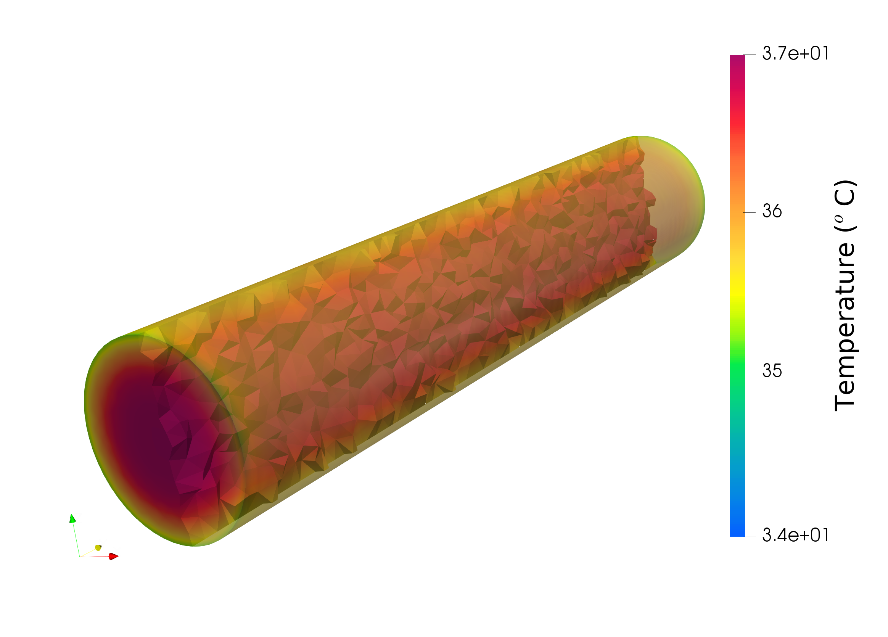
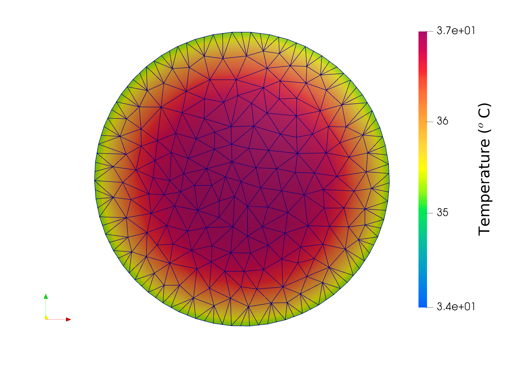

======================================================================
Heat Transfer in a Cylinder with Robin and Neumann Boundary Conditions
======================================================================

This example solves the heat transfer in a cylinder. The purpose of this example is to implement Robin boundary conditions in the OpenCMISS and enable it for convection or radiation heat transfer. 

The boundary conditions at one end of the cylinder is Neumann boundary conditions and over the rest of the boundary is Robin boundary conditions.
The dimensions of the cylinder is about the same as an adult human arm. The temperature for the whole cylinder initially is 37 Celcius and suddenly air with 10 Celcius blows over it and cools it down.
Because the heat flux is higher at the skin, at the beginning skin temperature drops quickly but the in depth temperature remains the same. 

A tetrahedra mesh for the cylinder was genenrated and tri-linear simplex interpolation is used for temperature interpolation in the elements.

Running the example
===================

Python version::

  cd ./src/python
  mkdir output
  python heat_transfer.py

Results
=======

Results can be visualised by `ParaView <https://www.paraview.org/>`_ or running `visualise.cmgui <./src/python/visualiseCoupled1D0D.cmgui>`_ with the `Cmgui visualiser <http://physiomeproject.org/software/opencmiss/cmgui/download>`_.

The following figures show the temperature distribution in the cylinder.

   **Figure 1:** Temperature distribution.

   **Figure 2:** Temperature distribution in the cylinder cross-section.

The expected results from this example are available in `expected_results <./src/python/expected_results>`_ folder.

Prerequisites
=============

There are two files describing the mesh in the input folder.

License
=======

License applicable to this example is described in `LICENSE <./LICENSE>`_.
